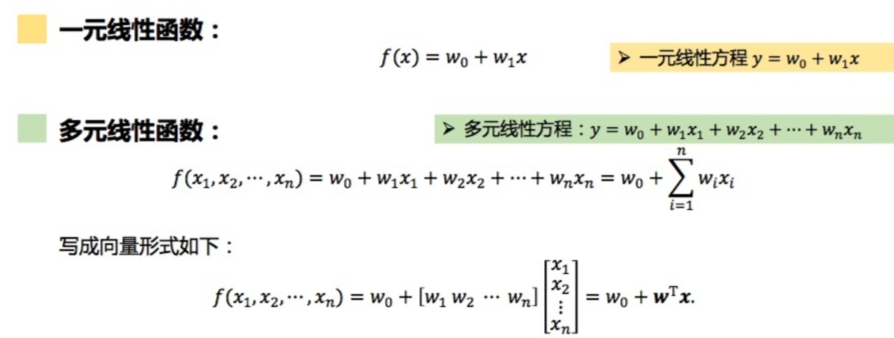
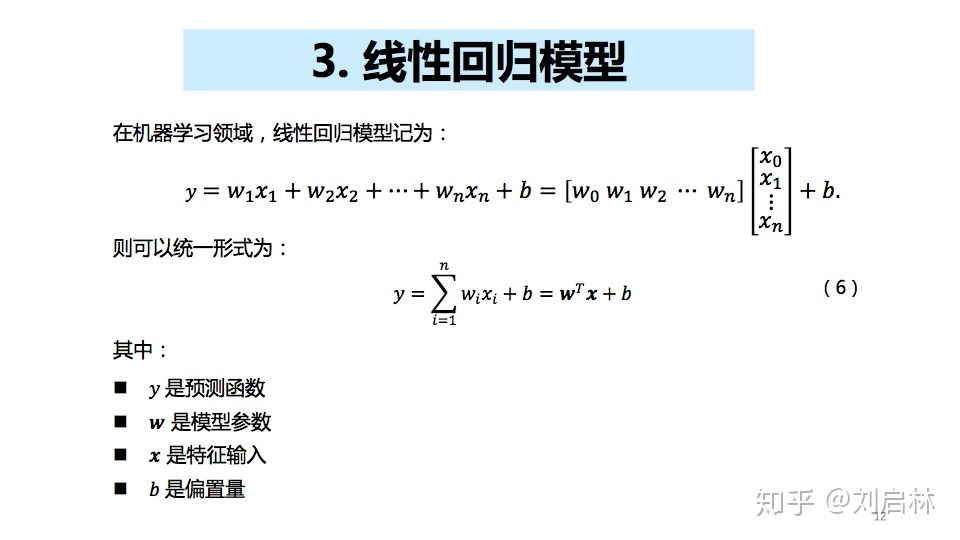
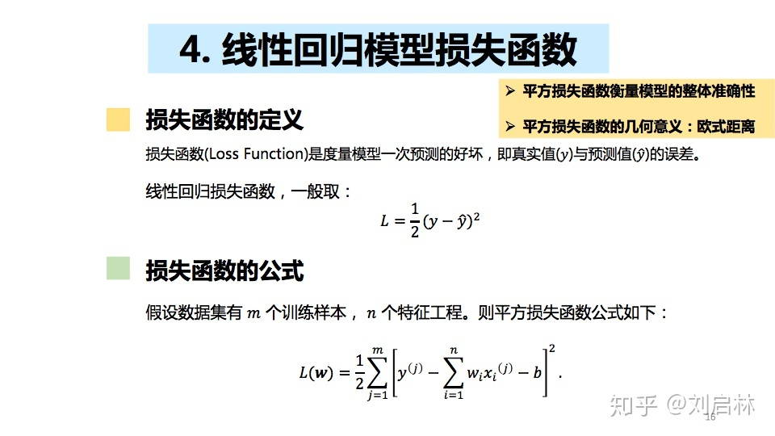
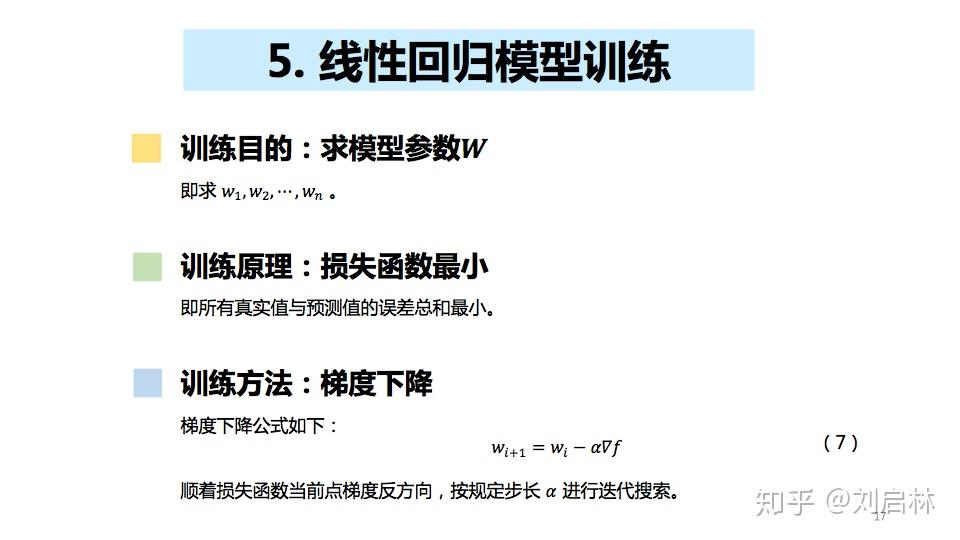

{
 "cells": [
  {
   "cell_type": "markdown",
   "source": [
    "## 线性回归\n",
    "### 什么是线性（Linear）\n",
    "- 在二元的直角坐标系中，变量关系可以通过一条直线描述，称为线性关系\n",
    "\n",
    "### 什么是回归（Regression）\n",
    "- 19世纪80年代，英国统计学家Francis Galton 弗朗西斯.高尔顿提出。子代身高有向族群平均身高回归的趋势\n",
    "\n",
    "### 什么是回归分析\n",
    "- 数理统计中，寻求变量之间近似的函数关系。\n",
    "\n",
    "### 什么是线性函数\n",
    "- 一元线性函数：\n",
    "- 多元线性函数：\n",
    "\n",
    "\n",
    "### 什么是线性回归\n",
    "- 回归函数为线性函数\n",
    "\n",
    "### 线性回归模型\n",
    "\n",
    "### 损失函数\n",
    "\n",
    "### 模型训练过程\n",
    "\n"
   ],
   "metadata": {
    "collapsed": false
   }
  }
 ],
 "metadata": {
  "kernelspec": {
   "display_name": "Python 3",
   "language": "python",
   "name": "python3"
  },
  "language_info": {
   "codemirror_mode": {
    "name": "ipython",
    "version": 2
   },
   "file_extension": ".py",
   "mimetype": "text/x-python",
   "name": "python",
   "nbconvert_exporter": "python",
   "pygments_lexer": "ipython2",
   "version": "2.7.6"
  }
 },
 "nbformat": 4,
 "nbformat_minor": 0
}
