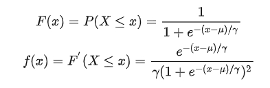
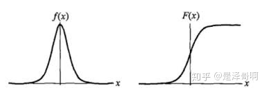
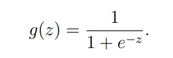
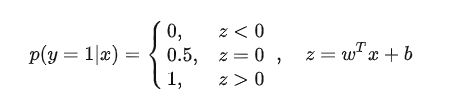

# 逻辑回归
- Logistic Regression 虽然被称为回归，但其实际上是分类模型，并常用于二分类。
- Logistic distribution 分布函数与密度函数
  - 
  - 
- 逻辑回归是在线性回归的基础上加了一个 Sigmoid 函数（非线形）映射
  - 线性回归是在实数域范围内进行预测，而分类范围则需要在 [0,1]，逻辑回归减少了预测范围；
线性回归在实数域上敏感度一致，而逻辑回归在 0 附近敏感，在远离 0 点位置不敏感，这个的好处就是模型更加关注分类边界，可以增加模型的鲁棒性。
  - 
  - 理想的单位阶跃函数
  - 
    - 但是阶跃函数不可微。
- 逻辑回归的思路是，先拟合决策边界(不局限于线性，还可以是多项式)，再建立这个边界与分类的概率联系，从而得到了二分类情况下的概率。
- 可以看到 Logistic 回归实际上是使用线性回归模型的预测值逼近分类任务真实标记的对数几率，其优点有：
  - 直接对分类的概率建模，无需实现假设数据分布，从而避免了假设分布不准确带来的问题（区别于生成式模型）； 
  - 不仅可预测出类别，还能得到该预测的概率，这对一些利用概率辅助决策的任务很有用；
  - 对数几率函数是任意阶可导的凸函数，有许多数值优化算法都可以求出最优解。