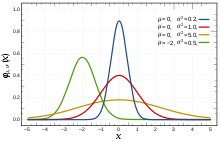
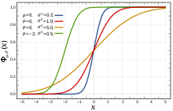

### 1、正态分布
- 概率密度函数：probability density function
- 正态分布、高斯分布：normal distribution or Gaussian distribution
- 
- 平均数为u 、标准差为sigma 
- 
- 累计分布函数 Cumulative distribution functions
- 
- 
- 生成正态分布
- Box-Muller变换
- ziggurat算法